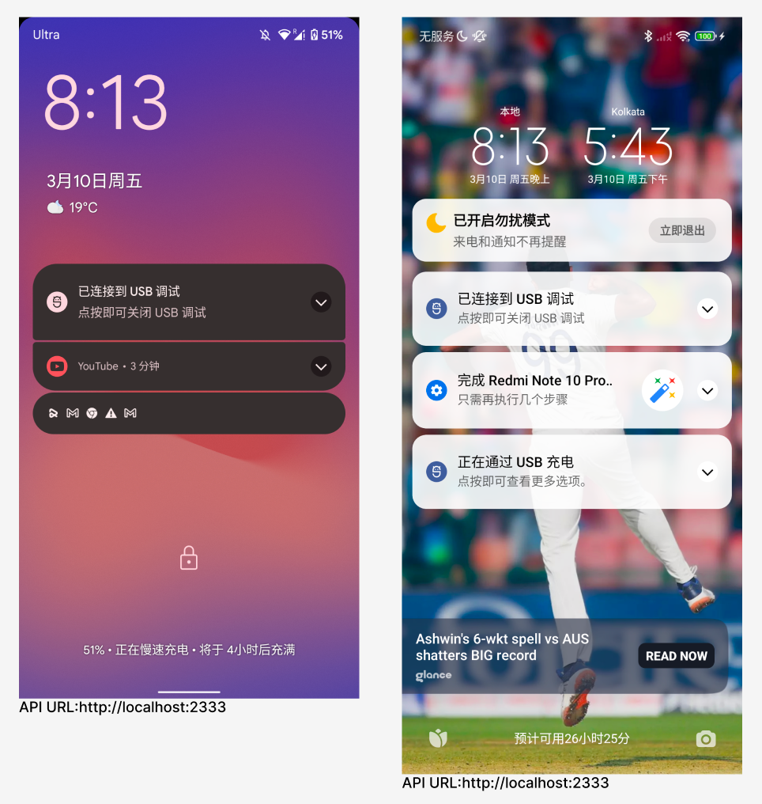
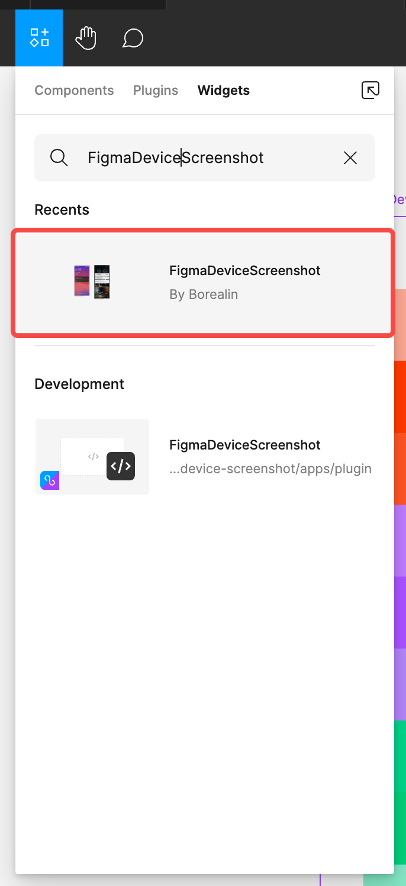
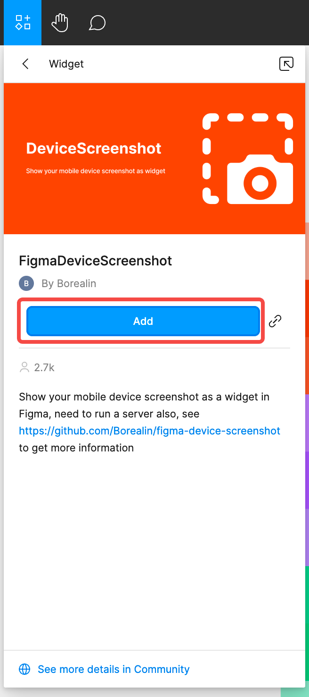
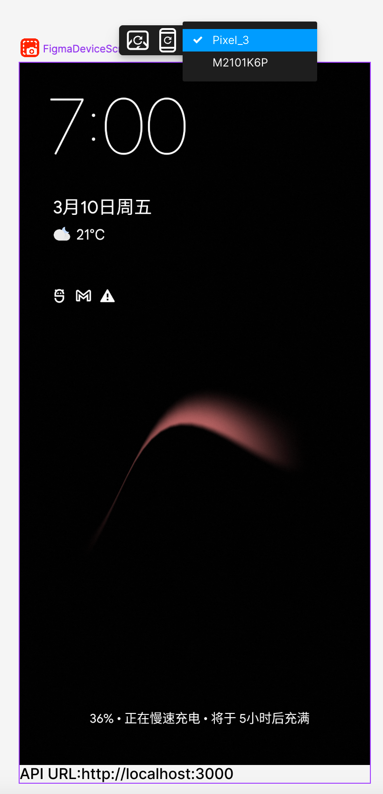
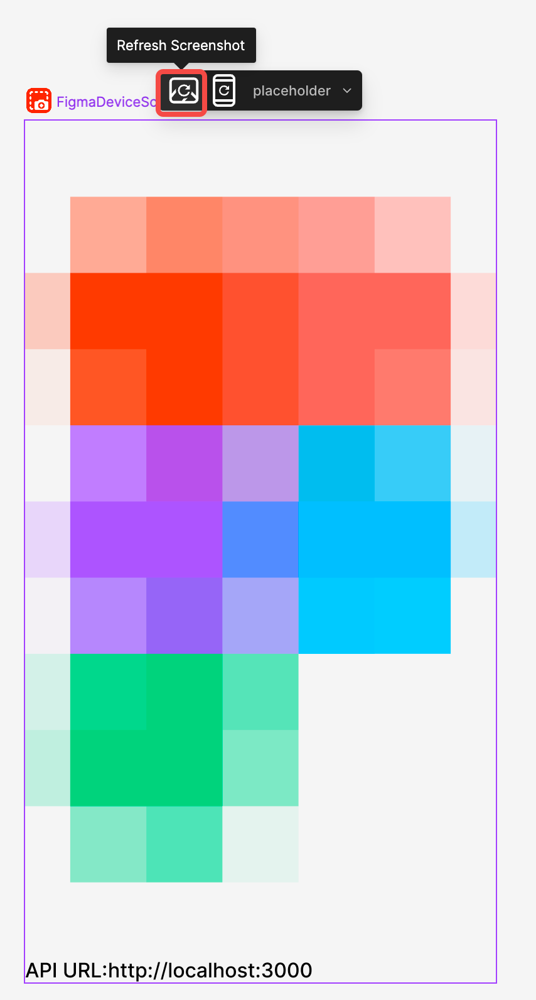
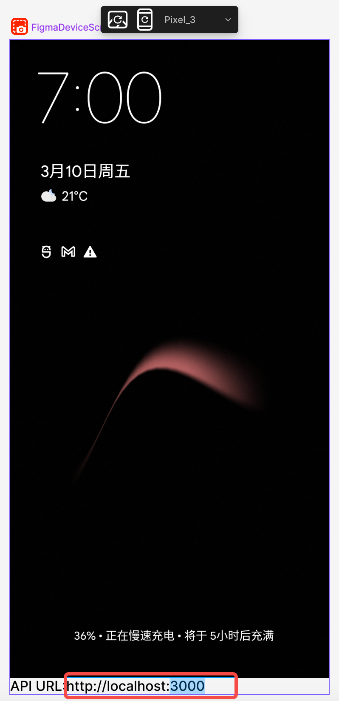

# Figma Device Screenshot Widget
This repository contains a Figma plugin that allows you to take screenshots on your Android devices and place into a Figma Image.

Which is useful when comparing designs with real devices.

## Preparation
### Install the plugin
Install from https://www.figma.com/community/widget/1204364503317721969
### Install the cli
```
npm install -g figma-device-screenshot-cli
```
### Run the server
```
figma-device-screenshot server [-p <port>]
```
## Usage

### Find the widget


### Add the widget to your frame


### Refresh devices


### Select a device


### Refresh screenshots


### Change API host (optional)


## Build
To install dependencies, run:
```bash
rush update
```
To build the whole project, run:
```bash
rush build
```
### Build the plugin
To build and watch the plugin, run:
```bash
cd apps/plugin
rushx watch
```


